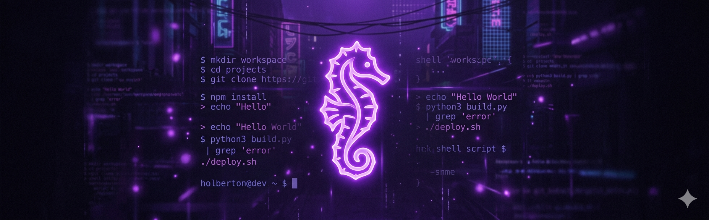

# holbertonschool-shell

> Talking to your computer without clicking anything — one script at a time. 🐚

---

## 📄 Description

This repository gathers all my shell scripting projects completed as part of the Holberton School curriculum. It is my first real encounter with the Linux command line: no mouse, no graphical interface, just a terminal, a blinking cursor, and a growing understanding of how computers actually work under the hood. Each project focuses on a specific set of shell concepts — from basic navigation and file manipulation to permissions, I/O redirections, and variable management. The goal is simple: become comfortable and confident in a shell environment, and understand the mechanics that most users never think about.

---

## 🎯 Learning Objectives

Across these projects, I learn how to navigate and manipulate the Linux filesystem using commands like `cd`, `ls`, `pwd`, `cp`, `mv`, and `rm`, and I gain a solid understanding of paths, directories, and symbolic links. I become able to manage file permissions and ownership using `chmod`, `chown`, and `chgrp`, and I understand the difference between user, group, and others in the Linux permission model. I explore how the shell initializes itself — through files like `/etc/profile` and `~/.bashrc` — and I learn to work with local and global variables, perform shell arithmetic, create aliases, and use expansions confidently. I also master I/O redirections and filters, which means I can redirect output to files, chain commands with pipes, and process text using tools like `grep`, `sort`, `uniq`, `cut`, `tr`, and `wc`. By the end of this repository, I am able to write clean, two-line Bash scripts that do exactly what they need to do — nothing more, nothing less.

---

## 📁 Repository Structure

```bash
holbertonschool-shell/
├── basics/
├── init_files_variables_and_expansions/
├── io_redirections_and_filters/
├── permissions/
└── README.md
```

---

## ✨ Projects / Contents

### basics
- Introduction to the Linux shell: filesystem navigation, file and directory manipulation, wildcards, symbolic and hard links
- Bash, Ubuntu 22.04 LTS, core commands: `cd`, `ls`, `pwd`, `cp`, `mv`, `rm`, `mkdir`, `ln`, `file`

### init_files_variables_and_expansions
- Shell initialization, local and global variables, arithmetic operations, aliases, quoting rules, and shell expansions
- Bash, Ubuntu 20.04 LTS, built-ins: `export`, `unset`, `alias`, `printenv`, `set`, `printf`

### io_redirections_and_filters
- Standard input/output redirections, pipes, and text filtering using Unix tools
- Bash, Ubuntu 20.04 LTS, tools: `echo`, `cat`, `head`, `tail`, `grep`, `sort`, `uniq`, `wc`, `tr`, `cut`, `find`, `rev`

### permissions
- Linux file permissions, ownership management, user and group manipulation
- Bash, Ubuntu 22.04 LTS, commands: `chmod`, `chown`, `chgrp`, `su`, `sudo`, `whoami`, `id`, `groups`

---

## 🛠️ Technologies Used

Every project in this repository is written in **Bash** and runs on **Ubuntu Linux** (20.04 or 22.04 LTS depending on the project). No external frameworks or dependencies are required — just a shell, the standard Unix toolkit, and a willingness to read `man` pages at inconvenient hours.

---

## ⚙️ Prerequisites

- OS: Ubuntu 20.04 LTS or Ubuntu 22.04 LTS
- Shell: Bash
- Allowed editors: `vi`, `vim`, `emacs`
- All scripts must be executable (`chmod u+x filename`)
- All scripts follow a strict two-line format with `#!/bin/bash` as the first line

---

## ▶️ Usage

```bash
git clone https://github.com/GwenP88/holbertonschool-shell.git
cd holbertonschool-shell
```

From there, navigate into any project directory and run scripts directly:

```bash
cd basics
chmod u+x 0-current_working_directory
./0-current_working_directory
```

Each project directory contains its own `README.md` describing what every script does. Start there to understand what you're running before you run it — because surprise deletions are only funny in retrospect.

---

## 🤝 Contributions & Acknowledgements

A big thank you to the Holberton School team for building a curriculum that turns total beginners into people who genuinely enjoy typing in a black box. Thanks also to my peers for their feedback, their patience, and their occasional "wait, that actually works?" reactions. And of course, eternal respect to the `man` pages — unsung heroes, always available, never judging.

---

## 👤 Author

**Gwenaelle PICHOT**
- Student at Holberton School
- Repository: `holbertonschool-shell`