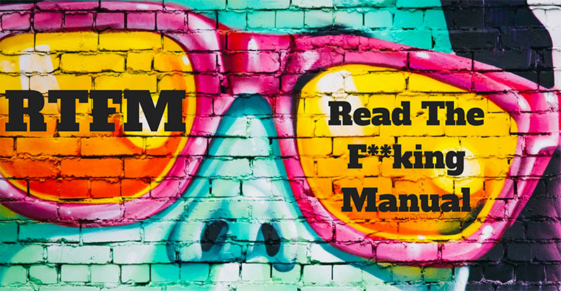

<p align="center>
    
</p>

# holbertonschool-shell

> Talking to your computer without clicking anything. Welcome to the shell. 🐚

---

## 📝 Description

This project marks my first steps into the Linux shell — no mouse, no GUI, just me, a blinking cursor, and the quiet confidence of someone who knows what `pwd` means. I learn how to navigate the filesystem, manipulate files and directories, and use the most essential Bash commands like a true terminal wizard (or at least a convincing apprentice).

---

## 🎯 Learning Objectives

By the end of this project, I am able to explain how the shell works to anyone—without secretly checking :contentReference[oaicite:0]{index=0}.

I understand what “RTFM” really means (yes, reading the docs first actually helps) and what a shebang is (no explosions involved, just script execution magic).

I know what the shell is, how it differs from the terminal, what the prompt represents, and how to use my command history instead of rewriting the same command again and again.

I navigate the filesystem confidently using `cd`, `pwd`, and `ls`, understand working, root, and home directories, and finally stop mixing up `/` and `~`. Bonus: `cd -` has become my new best friend.

I explore files with `ls`, `less`, and `file`, understand options and arguments, read the `ls -l` format without fear, and get familiar with common system directories.

I also understand symbolic and hard links (and their differences) without breaking everything.

Finally, I manipulate files using `cp`, `mv`, `rm`, and `mkdir`, and master wildcards—because typing full file names is overrated.

---

## 🛠️ Technologies Used

- **Shell**: Bash (the original, the legend)
- **OS**: Ubuntu 22.04 LTS
- **Key commands**: `cd`, `ls`, `pwd`, `less`, `file`, `ln`, `cp`, `mv`, `rm`, `mkdir`, `type`, `which`, `help`, `man`

---

## ⚙️ Requirements

- OS: Ubuntu 22.04 LTS
- Allowed editors: `vi`, `vim`, `emacs`
- All scripts must be exactly **two lines long** (`$ wc -l file` should print `2`) — yes, two. Not three.
- All files must end with a new line
- The first line of all files must be exactly: `#!/bin/bash`
- A `README.md` file at the root of the repo containing a description of the repository is mandatory
- A `README.md` file at the root of the project folder describing what each script does is mandatory
- You are not allowed to use backticks, `&&`, `||` or `;`
- All scripts must be executable (`chmod u+x FILENAME`)

---

## 🚀 Installation

```bash
git clone https://github.com/GwenP88/holbertonschool-shell
cd holbertonschool-shell/basics
```

---

## ▶️ Usage / Execution

All Bash scripts can be executed in two ways:

### 1. Direct execution
Make the file executable and run it directly:
```bash
chmod u+x filename
./filename
```

### 2. Using Bash interpreter
Run the script with Bash:
```bash
bash filename
```

---

## 📊 Project Progress

<p align="center">

</p>

<p align="center">
<sub>Mandatory tasks completion: 100%</sub>
</p>

---

## ✨ Features

### Task 0 - Where am I?

- **Status**: Mandatory
- **Objective**: Print the absolute path name of the current working directory
- **Constraint**: None
- **Expected behavior**: Displays the absolute path of the current directory (e.g. `/basics`) — because getting lost on your own machine is not a vibe

**Files**: `0-current_working_directory`

---

### Task 1 - What's in there?

- **Status**: Mandatory
- **Objective**: Display the contents list of the current directory
- **Constraint**: None
- **Expected behavior**: Lists all files and folders in the current directory

**Files**: `1-listit`

---

### Task 2 - There is no place like home

- **Status**: Mandatory
- **Objective**: Change the working directory to the user's home directory
- **Constraint**: Not allowed to use any shell variables
- **Expected behavior**: Moves to the home directory without using `$HOME` — Dorothy would be proud

**Files**: `2-bring_me_home`

---

### Task 3 - The long format

- **Status**: Mandatory
- **Objective**: Display current directory contents in long format
- **Constraint**: None
- **Expected behavior**: Displays permissions, owner, size, and date for each file — more info than you asked for, exactly as requested

**Files**: `3-listfiles`

---

### Task 4 - Hidden files

- **Status**: Mandatory
- **Objective**: Display current directory contents in long format, including hidden files
- **Constraint**: None
- **Expected behavior**: Displays all files, including those starting with `.` — no secrets allowed

**Files**: `4-listmorefiles`

---

### Task 5 - I love numbers

- **Status**: Mandatory
- **Objective**: Display current directory contents in long format with numeric UIDs/GIDs and hidden files
- **Constraint**: None
- **Expected behavior**: Displays user and group IDs as numbers — for those who prefer their data extra raw

**Files**: `5-listfilesdigitonly`

---

### Task 6 - Welcome

- **Status**: Mandatory
- **Objective**: Create a directory named `my_first_directory` in `/tmp/`
- **Constraint**: None
- **Expected behavior**: The directory `/tmp/my_first_directory` exists after execution — it's alive!

**Files**: `6-firstdirectory`

---

### Task 7 - Betty in my first directory

- **Status**: Mandatory
- **Objective**: Move the file `betty` from `/tmp/` to `/tmp/my_first_directory`
- **Constraint**: None
- **Expected behavior**: The file `betty` is relocated to `/tmp/my_first_directory` — moving day, shell edition

**Files**: `7-movethatfile`

---

### Task 8 - Bye bye Betty

- **Status**: Mandatory
- **Objective**: Delete the file `betty` located in `/tmp/my_first_directory`
- **Constraint**: None
- **Expected behavior**: The file `betty` no longer exists — it was fun while it lasted

**Files**: `8-firstdelete`

---

### Task 9 - Bye bye My first directory

- **Status**: Mandatory
- **Objective**: Delete the directory `my_first_directory` located in `/tmp`
- **Constraint**: None
- **Expected behavior**: The directory `/tmp/my_first_directory` no longer exists — what we create, we can also destroy

**Files**: `9-firstdirdeletion`

---

### Task 10 - Back to the future

- **Status**: Mandatory
- **Objective**: Change the working directory to the previous one
- **Constraint**: None
- **Expected behavior**: Moves back to the previously visited directory — no DeLorean required

**Files**: `10-back`

---

### Task 11 - Lists

- **Status**: Mandatory
- **Objective**: List all files (including hidden ones) in the current directory, the parent directory, and `/boot`, in long format
- **Constraint**: Be careful with the `/`
- **Expected behavior**: Displays the contents of all three directories in the specified order — a grand tour

**Files**: `11-lists`

---

### Task 12 - File type

- **Status**: Mandatory
- **Objective**: Print the type of the file named `iamafile` located in `/tmp`
- **Constraint**: None
- **Expected behavior**: Displays the file type — because `iamafile` deserves to know what it is

**Files**: `12-file_type`

---

### Task 13 - We are symbols, and inhabit symbols

- **Status**: Mandatory
- **Objective**: Create a symbolic link to `/bin/ls` named `__ls__` in the current working directory
- **Constraint**: None
- **Expected behavior**: A symbolic link `__ls__ -> /bin/ls` appears — the philosophical one of the bunch

**Files**: `13-symbolic_link`

---

### Task 14 - Copy HTML files

- **Status**: Mandatory
- **Objective**: Copy all `.html` files from the current directory to the parent directory, only if they don't already exist there or are newer
- **Constraint**: Only files with the `.html` extension are concerned
- **Expected behavior**: HTML files are conditionally copied — smart copy, no unnecessary duplicates

**Files**: `14-copy_html`

---

### Task 15 - Let's move

- **Status**: Mandatory
- **Objective**: Move all files beginning with an uppercase letter to `/tmp/u`
- **Constraint**: The directory `/tmp/u` will exist when the script is run
- **Expected behavior**: Only files starting with an uppercase letter are moved — the VIPs get their own room

**Files**: `15-lets_move`

---

### Task 16 - Clean Emacs

- **Status**: Mandatory
- **Objective**: Delete all files in the current working directory that end with the character `~`
- **Constraint**: None
- **Expected behavior**: Emacs backup files (e.g. `main.c~`) are deleted — keeping things tidy, one tilde at a time

**Files**: `16-clean_emacs`

---

### Task 17 - Tree

- **Status**: Mandatory
- **Objective**: Create the directories `welcome/`, `welcome/to/` and `welcome/to/school` in the current directory
- **Constraint**: Only two spaces (and lines) are allowed in the script — brevity is the soul of shell
- **Expected behavior**: The directory tree `welcome/to/school` is created in a single command

**Files**: `17-tree`

---

## 🤝 Contributions & Acknowledgements

- Project completed as part of the **Holberton School** curriculum 🎓  
- Big thanks to my peers and reviewers for their feedback — and special shoutout to the `man` pages, the real MVPs working quietly behind the scenes 🧙‍♂️

---

## 👤 Author

**Gwenaelle PICHOT**
- Student at Holberton School
- Track: `holbertonschool-shell`
- Project: `basics`