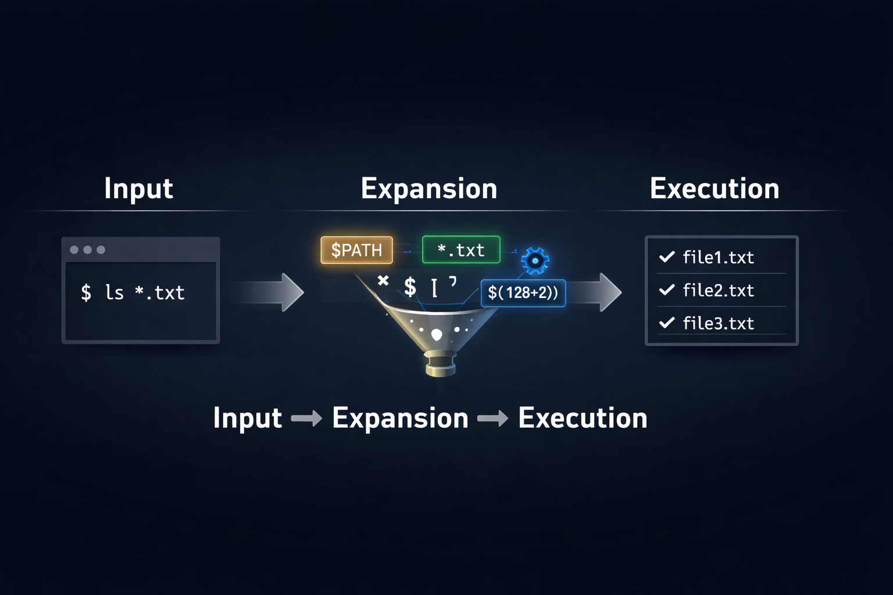

# init_files_variables_and_expansions

> Variables, aliases, and expansions — because a shell without them is just a very expensive notepad.

---

## 📝 Description

This project is part of my shell scripting curriculum at Holberton School. It dives deep into how the shell initializes, manages variables, and performs expansions. Through a series of two-line Bash scripts, I explore environment and local variables, shell arithmetic, aliases, quoting rules, and how the shell interprets and expands what I type before actually running it. Think of it as learning the secret language the terminal speaks to itself before doing anything useful.

---

## 🎯 Learning Objectives

At the end of this project, I am able to explain what happens when I type `$ ls -l *.txt` in a shell and how the shell processes that command before executing it. I understand the purpose of the `/etc/profile` file and the `/etc/profile.d` directory, as well as the role of the `~/.bashrc` file in shell initialization. I know the difference between a local and a global variable, what reserved variables are, and how to create, update, and delete shell variables. I can explain the roles of the reserved variables `HOME`, `PATH`, and `PS1`, and I understand what special parameters are, including `$?` and what it tells me about the last executed command. I am able to use expansions effectively, understand the difference between single and double quotes, and perform command substitution using both `$()` and backticks. I know how to perform arithmetic operations directly in the shell. I can create, list, and temporarily disable aliases. Finally, I know how to execute commands from a file in the current shell using `.` or `source`.

---

## 🛠️ Technologies Used

All scripts in this project are written in **Bash** and run on **Ubuntu 20.04 LTS**. The key built-ins and commands covered include `printenv`, `set`, `unset`, `export`, `alias`, `unalias`, `.` (source), and `printf`. No external libraries or dependencies are required — just a shell and a curious mind.

---

## ⚙️ Requirements

- **OS:** Ubuntu 20.04 LTS
- **Allowed editors:** `vi`, `vim`, `emacs`
- All scripts must be exactly **two lines long** (`wc -l file` must print `2`)
- All files must end with a **new line**
- The first line of every script must be exactly `#!/bin/bash`
- All files must be **executable**
- The use of `&&`, `||`, and `;` is **not allowed**
- The use of `bc`, `sed`, and `awk` is **not allowed**
- A `README.md` at the root of the project folder is mandatory

---

## 🚀 Installation

```bash
git clone https://github.com/GwenP88/holbertonschool-shell.git
cd holbertonschool-shell/init_files_variables_and_expansions
```

---

## ▶️ Usage / Execution

Make a script executable and run it directly:

```bash
chmod +x ./0-alias
./0-alias
```

Some scripts must be **sourced** to take effect in the current shell (especially those modifying variables or aliases):

```bash
source ./0-alias
# or equivalently:
. ./0-alias
```

---

## 📊 Project Progress

<p align="center">

</p>

<p align="center">
<sub>Mandatory tasks completion: 100% --- Advanced tasks completion: 100%</sub>
</p>

---

## ✨ Features

### Task 0 - \<o\>

- Mandatory
- Create an alias named `ls` with the value `rm -f *`
- Must use the `alias` built-in
- After sourcing, typing `ls` deletes all files in the current directory

**Files:** `0-alias`

---

### Task 1 - Hello you

- Mandatory
- Print `hello user`, where `user` is the current Linux user
- Must use the `USER` environment variable
- Outputs `hello <current_username>` followed by a new line

**Files:** `1-hello_you`

---

### Task 2 - The path to success is to take massive, determined action

- Mandatory
- Add `/action` to the end of the `PATH` variable
- Must not overwrite the existing `PATH`
- After sourcing, `/action` appears as the last directory in `$PATH`

**Files:** `2-path`

---

### Task 3 - If the path be beautiful, let us not ask where it leads

- Mandatory
- Count and print the number of directories in the `PATH`
- Must handle edge cases such as empty entries
- Outputs a single integer representing the number of directories in `$PATH`

**Files:** `3-paths`

---

### Task 4 - Global variables

- Mandatory
- List all environment variables
- Must use `printenv`
- Outputs all currently exported environment variables

**Files:** `4-global_variables`

---

### Task 5 - Local variables

- Mandatory
- List all local variables, environment variables, and functions
- Must use `set`
- Outputs a comprehensive list of all shell variables and functions

**Files:** `5-local_variables`

---

### Task 6 - Local variable

- Mandatory
- Create a new local variable named `BEST` with the value `School`
- Must not export the variable
- The variable exists only in the current shell session and is not visible to child processes

**Files:** `6-create_local_variable`

---

### Task 7 - Global variable

- Mandatory
- Create a new global (exported) variable named `BEST` with the value `School`
- Must use `export`
- The variable is accessible to child processes

**Files:** `7-create_global_variable`

---

### Task 8 - Every addition to true knowledge is an addition to human power

- Mandatory
- Print the result of adding 128 to the value stored in the environment variable `TRUEKNOWLEDGE`
- Must perform shell arithmetic
- Outputs the integer result followed by a new line

**Files:** `8-true_knowledge`

---

### Task 9 - Divide and rule

- Mandatory
- Print the result of dividing the environment variable `POWER` by `DIVIDE`
- Both variables are set as environment variables before running the script
- Outputs the integer result of the division followed by a new line

**Files:** `9-divide_and_rule`

---

### Task 10 - Love is anterior to life, posterior to death, initial of creation, and the exponent of breath

- Mandatory
- Print the result of raising `BREATH` to the power of `LOVE`
- Both `BREATH` and `LOVE` are environment variables
- Outputs the result followed by a new line

**Files:** `10-love_exponent_breath`

---

### Task 11 - There are 10 types of people in the world -- Those who understand binary, and those who don't

- Mandatory
- Convert a number from base 2 (stored in `$BINARY`) to base 10 and print it
- Must use shell arithmetic or built-in base conversion
- Outputs the decimal value followed by a new line

**Files:** `11-binary_to_decimal`

---

### Task 12 - Combination

- Mandatory
- Print all possible combinations of two lowercase letters, except `oo`, in alphabetical order
- Script file must contain a maximum of 64 characters
- Outputs 675 combinations, one per line, sorted alphabetically starting with `aa`

**Files:** `12-combinations`

---

### Task 13 - Floats

- Mandatory
- Print the number stored in `$NUM` with exactly two decimal places
- Must use `printf`
- Outputs the formatted float followed by a new line

**Files:** `13-print_float`

---

### Task 14 - Decimal to Hexadecimal

- Mandatory
- Convert a number from base 10 (stored in `$DECIMAL`) to base 16 and print it
- Must use shell arithmetic or built-in base conversion
- Outputs the hexadecimal value followed by a new line

**Files:** `14-decimal_to_hexadecimal`

---

### Task 15 - What happens when you type ls \*.c

- Advanced
- Write a blog post explaining step by step what happens when typing `ls *.c` and hitting Enter
- Must include at least one image; must be published on Medium or LinkedIn and shared on LinkedIn; must be written in English
- A clear, beginner-friendly article explaining shell expansion, globbing, and command execution

**Files:** *(blog post URL)*

---

### Task 16 - Everyone is a proponent of strong encryption

- Advanced
- Encode and decode text using ROT13 encryption on ASCII input
- Must use `tr`
- Outputs the ROT13-encoded version of the input

**Files:** `15-rot13`

---

### Task 17 - The eggs of the brood need to be an odd number

- Advanced
- Print every other line from the input, starting with the first line
- Must use shell built-ins or filters
- Outputs lines 1, 3, 5, … of the input

**Files:** `16-odd`

---

### Task 18 - I'm an instant star. Just add water and stir.

- Advanced
- Add two numbers stored in `$WATER` (base `water`) and `$STIR` (base `stir.`) and print the result in base `bestchol`
- Must handle custom base encoding/decoding
- Outputs the sum in base `bestchol`

**Files:** `17-water_and_stir`

---

## 🤝 Contributions & Acknowledgements

Huge thanks to the Holberton School team for designing tasks that make you think twice about what a "simple" two-line script can actually do. Special mention to whoever invented shell arithmetic — you are the reason I no longer reach for a calculator.

---

## 👤 Author

**Gwenaelle PICHOT**
- Student at Holberton School
- Track: `holbertonschool-shell`
- Project: `init_files_variables_and_expansions`